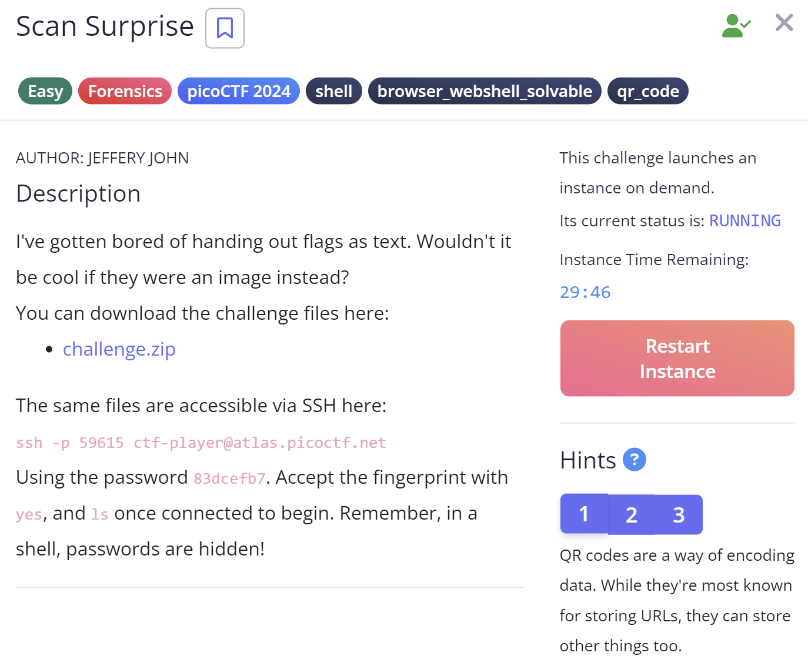
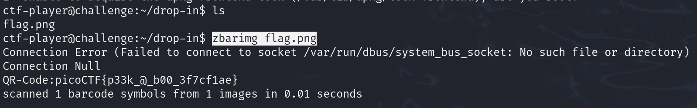

## Scan Surprise



Saya sudah bosan membagikan bendera dalam bentuk teks. Bukankah akan lebih keren jika bendera itu berupa gambar?

Hints
1. Kode QR adalah cara untuk mengkodekan data. Meskipun paling dikenal untuk menyimpan URL, kode ini juga dapat menyimpan hal-hal lain.
2. Ponsel telah menyertakan pemindai kode QR asli di kameranya sejak versi 8 (Oreo) dan iOS 11
3. Jika Anda tidak memiliki akses ke ponsel, Anda juga dapat menggunakan zbar-tools untuk mengonversi gambar menjadi teks


Untuk menyelesaikannya, kita bisa menggunakan tools Zbar untuk mengkonversi gambar ke text

```
zbarimg flag.png
```


