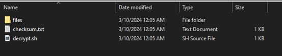

## VERIFY


Deskripsi

Orang-orang terus mencoba menipu pemain saya dengan bendera tiruan. Saya ingin memastikan mereka mendapatkan yang asli! Saya akan memberikan hash SHA-256 dan skrip dekripsi untuk membantu Anda memastikan bahwa bendera saya sah.

hints
1.	Checksum memungkinkan Anda mengetahui apakah sebuah file lengkap dan berasal dari distributor asli. Jika hash tidak cocok, berarti itu adalah file yang berbeda.
2.	Anda dapat membuat checksum SHA dari sebuah file dengan menggunakan sha256sum <file> atau dari semua file di dalam sebuah direktori dengan menggunakan sha256sum <directory>/*.
3.	Ingat, Anda dapat mengalirkan output dari satu perintah ke perintah lain dengan menggunakan |. Cobalah berlatih dengan tantangan 'First Grep' jika Anda mengalami kesulitan!


Untuk mengerjakan tantangan ini, pertama saya mengunduh file 



dari file yang di unduh, ada file checksum.txt yang menjadi petunjuk hash kita yaitu 467a10447deb3d4e17634cacc2a68ba6c2bb62a6637dad9145ea673bf0be5e02
untuk selanjutnya, kita bisa menggunakan perintah pada terminal untuk melihat file hash dari isi direktori files, perintah yang dijalankan adalah 
```sh
sha256sum files/*
```

