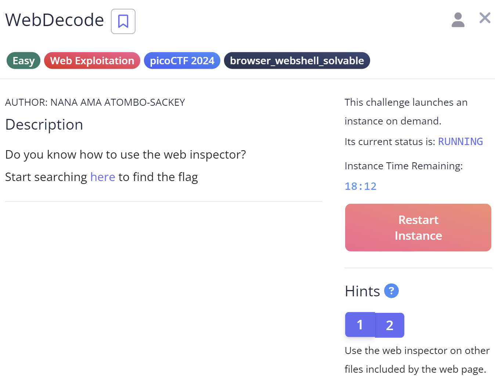

## WebDecode

Apakah Anda tahu cara menggunakan inspektor web?

Hint
1. Gunakan inspektor web pada file lain yang disertakan oleh halaman web.
2. Bendera mungkin dikodekan atau tidak dikodekan

Untuk Menyelesaikan tantangan ini, kita membuka webnya terlebih dahulu dan menggunakan web inspektor

Tapi pada halaman utama, tidak ada kata "picoctf" dan tidak ada yang di sembunyikan pada source code.

pada halaman "about", ada code yang aneh.
yaitu `cGljb0NURnt3ZWJfc3VjYzNzc2Z1bGx5X2QzYzBkZWRfMWY4MzI2MTV9`

kita coba decode pada cyberchef.

